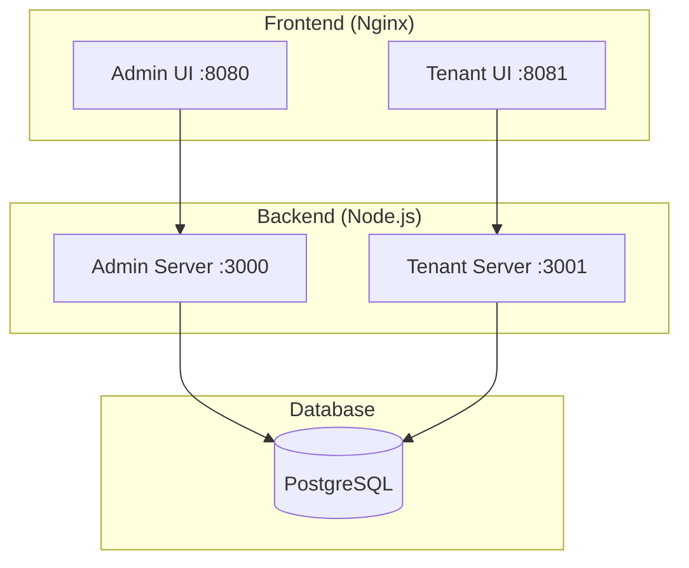

# ComplyArk - Cookie Consent Management Platform

A DPDPA-compliant consent management platform with Super Admin governance and multi-tenant support.

## 📦 Project Structure

```
Cookie-Gate/
├── Admin Portal/          # Super Admin governance platform
│   └── apps/
│       ├── server/        # Fastify backend (port 3000)
│       └── admin-ui/      # React/Vite frontend
├── Tenant Platform/       # Multi-tenant CMP platform
│   └── apps/
│       ├── server/        # Fastify backend (port 3001)
│       └── tenant-ui/     # React/Vite frontend
├── docker-compose.prod.yml
└── .env.example
```

---

## 🚀 Quick Start (Development)

### Prerequisites
- Node.js 20+
- Docker Desktop (for PostgreSQL)
- npm 9+

### 1. Start Database
```bash
cd "Admin Portal"
docker-compose up -d
```

### 2. Run Migrations
```bash
# Admin Portal migrations
cd "Admin Portal/apps/server"
cp .env.example .env
npm install
npm run migrate:up

# Tenant Platform migrations
cd "../../Tenant Platform/apps/server"
cp .env.example .env
npm install
npm run migrate:up
```

### 3. Start Development Servers
```bash
# Terminal 1: Admin Server
cd "Admin Portal/apps/server"
npm run dev

# Terminal 2: Admin UI
cd "Admin Portal/apps/admin-ui"
npm install && npm run dev

# Terminal 3: Tenant Server
cd "Tenant Platform/apps/server"
npm run dev

# Terminal 4: Tenant UI
cd "Tenant Platform/apps/tenant-ui"
npm install && npm run dev
```

### 4. Access Applications
| App | URL |
|-----|-----|
| Admin UI | http://localhost:5173 |
| Tenant UI | http://localhost:5174 |
| Admin API | http://localhost:3000 |
| Tenant API | http://localhost:3001 |

---

## 🏗️ Building for Production

### Option 1: Docker Compose (Recommended)
```bash
# Copy and configure environment
cp .env.example .env
# Edit .env with production values

# Build and start all services
docker-compose -f docker-compose.prod.yml up --build -d

# View logs
docker-compose -f docker-compose.prod.yml logs -f
```

### Option 2: Manual Build
```bash
# Build Admin Server
cd "Admin Portal/apps/server"
npm ci && npm run build

# Build Admin UI
cd "../admin-ui"
npm ci && npm run build
# Output: dist/

# Build Tenant Server
cd "../../Tenant Platform/apps/server"
npm ci && npm run build

# Build Tenant UI
cd "../tenant-ui"
npm ci && npm run build
# Output: dist/
```

---

## 🌐 Deployment

### Production URLs (Docker Compose)
| Service | Port |
|---------|------|
| Admin UI | 8080 |
| Tenant UI | 8081 |
| Admin API | 3000 |
| Tenant API | 3001 |
| PostgreSQL | 5432 (internal) |

### Environment Variables
See [.env.example](.env.example) for all required variables.

**Critical variables:**
```bash
DB_PASSWORD=<strong-password>
JWT_SECRET=<generate-with-openssl-rand-base64-64>
```

### Database Migrations
Migrations run automatically on `docker-compose up`. For manual runs:
```bash
docker exec -it complyark-admin-server npm run migrate:up
docker exec -it complyark-tenant-server npm run migrate:up
```

---

## 🔧 DevOps Summary

### Architecture


### Deployment Pipeline

| Stage | Tool | Action |
|-------|------|--------|
| **Build** | Docker | Multi-stage builds for minimal images |
| **Migrate** | node-pg-migrate | Auto-run before servers start |
| **Deploy** | docker-compose | Orchestrate all services |
| **Monitor** | Health checks | Built-in Docker health checks |

### Recommended Production Setup

1. **Reverse Proxy**: NGINX or Caddy for SSL termination
2. **Database**: AWS RDS or managed Postgres (optional)
3. **Logging**: Docker logs → CloudWatch/Datadog
4. **Backups**: Automated pg_dump or cloud snapshots

### CI/CD (Future)
```yaml
# Example GitHub Actions
on: push
jobs:
  deploy:
    steps:
      - docker-compose -f docker-compose.prod.yml build
      - docker-compose -f docker-compose.prod.yml push
      - ssh deploy@server "docker-compose pull && docker-compose up -d"
```

---

## 📁 Key Files

| File | Purpose |
|------|---------|
| `docker-compose.prod.yml` | Production orchestration |
| `.env.example` | Environment template |
| `*/Dockerfile` | Container build instructions |
| `*/nginx.conf` | UI server configuration |
| `*/migrations/` | Database schema changes |

---

## 🛠️ Useful Commands

```bash
# Rebuild single service
docker-compose -f docker-compose.prod.yml up --build admin-server

# View database
docker exec -it complyark-db psql -U ark -d ark_db

# Backup database
docker exec complyark-db pg_dump -U ark ark_db > backup.sql

# Restore database
cat backup.sql | docker exec -i complyark-db psql -U ark -d ark_db

# Stop all services
docker-compose -f docker-compose.prod.yml down

# Stop and remove volumes (⚠️ deletes data)
docker-compose -f docker-compose.prod.yml down -v
```

---

## 📄 License

Proprietary - ComplyArk
