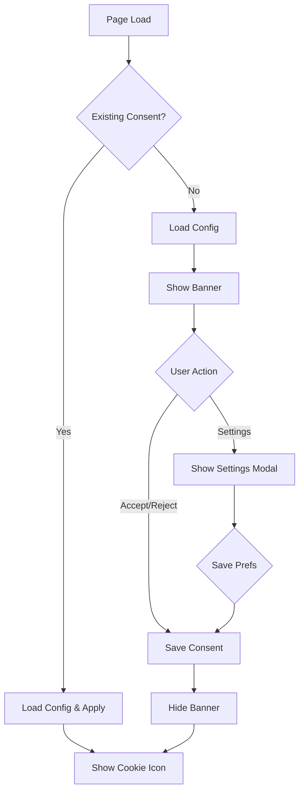

# Cookie Consent Architecture & Flow

## 1. High-Level Flow



## 2. Detailed Verification Logic

### Initialization (`init()`)
1.  **Intercept Scripts**: Scans DOM for blocked resources (e.g. Google Analytics).
2.  **Check Storage**:
    *   **Primary**: Checks `document.cookie` for `complyark-consent`.
    *   **Fallback**: Checks `localStorage` (Critical for `file://` usage).
3.  **Validation**: Verifies `websiteId` matches current config.

### Persistence (`saveConsent()`)
*   **Trigger**: User clicks "Accept", "Reject", or "Save Preferences".
*   **Storage Actions**:
    1.  **Cookie**: Writes `complyark-consent` (Max-Age: 180 days).
    2.  **LocalStorage**: Writes backup copy (to survive browser clearing or file:// limitations).
*   **Data Structure**:
    ```json
    {
      "purposes": { "analytics": true },
      "websiteId": "UUID",
      "timestamp": 1705869234567,
      "language": "en"
    }
    ```

### Withdrawal (`withdrawConsent()`)
*   **Trigger**: `window.ComplyArk.withdrawConsent()`
*   **Actions**:
    1.  Removes generic cookie.
    2.  Clears `localStorage`.
    3.  **UI Update**:
        *   `hideCookieIcon()`: Removes floating icon.
        *   `showBanner()`: Re-initializes banner.

## 3. UI Dependencies

| Component | Depends On | Behavior |
| :--- | :--- | :--- |
| **Loader Script** | `window` object | Injects styles, creates shadow DOM host. |
| **Banner** | `state.config` | Renders only if config fetch succeeds. |
| **Cookie Icon** | `state.consentGiven` | Visible only when consent is TRUE. |
| **Settings Modal** | `state.config` | Generates toggles dynamic based on `purposes`. |

## 4. Critical Dependencies

### `file://` Protocol Support
*   **Dependency**: `localStorage` (The cookie API is often restricted on local files).
*   **Impact**: If `localStorage` fallback code is removed, consent **will not persist** on refresh during local testing.

### Server Config
*   **Dependency**: `/runtime/websites/:id` endpoint.
*   **Impact**: If API fails or returns invalid JSON, the banner will **not show** (Fail Closed safety).

### Language Support
*   **Dependency**: `config.supportedLanguages` array.
*   **Impact**: Dropdown appears only if > 1 language is defined.

## 5. Multi-Tenant SaaS Architecture

ComplyArk is designed as a multi-tenant platform. The cookie consent service is injected into **multiple independent client websites**.

*   **Isolation**: Each tenant website has a unique `websiteId`.
*   **Storage Scope**: Cookies are stored on the **client's domain** (First-Party Context).
    *   Example: `client-a.com` stores `complyark-consent` for `client-a`.
    *   Example: `client-b.com` stores a *separate* `complyark-consent` for `client-b`.
*   **Cross-Domain**: Consent is NOT shared between different client domains (by design, to respect privacy boundaries).

## 6. UI State Matrix (Banner vs. Icon)

| Scenario | Trigger | Banner Status | Corner Cookie Icon |
| :--- | :--- | :---: | :---: |
| **New Visitor** | First page load (No consent found) | **VISIBLE** | HIDDEN |
| **Consented** | User clicked Accept/Reject | HIDDEN | **VISIBLE** |
| **Returning** | Subsequent visits (Consent in cookie) | HIDDEN | **VISIBLE** |
| **Settings** | User clicks corner icon | HIDDEN | **VISIBLE** (behind modal) |
| **Withdrawn** | User invoked `withdrawConsent()` | **VISIBLE** | HIDDEN |

